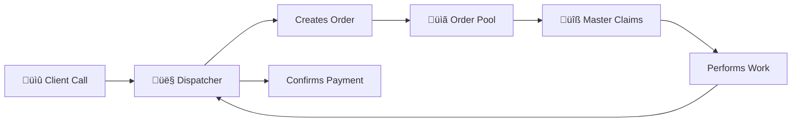

# Master KG v5 - Complete Technical Documentation

> **Version**: 5.0  
> **Last Updated**: February 2026  
> **Architecture**: Dispatcher-Mediated Service Platform

---

## Table of Contents

1. [General Overview](#1-general-overview)
2. [Data Architecture](#2-data-architecture)
3. [User Roles & Permissions](#3-user-roles--permissions)
4. [File Appendix](#4-file-appendix)

---

# 1. General Overview

## 1.1 Application Purpose

Master KG is a **dispatcher-mediated plumbing service marketplace** connecting clients with verified master plumbers. Unlike traditional P2P marketplaces, all client interactions flow through dispatchers who:

- Receive client calls and create orders
- Assign jobs to verified masters
- Confirm payments and close orders
- Handle disputes and quality issues



## 1.2 Technology Stack

| Layer | Technology | Version |
|-------|------------|---------|
| **Frontend** | React Native (Expo) | SDK 54 |
| **Navigation** | React Navigation | 7.x |
| **Backend** | Supabase (PostgreSQL) | Latest |
| **Authentication** | Supabase Auth | JWT-based |
| **Storage** | AsyncStorage | 2.2.0 |
| **Styling** | StyleSheet + LinearGradient | Native |

## 1.3 Core Dependencies

```json
{
  "@supabase/supabase-js": "^2.89.0",
  "@react-navigation/native": "^7.1.26",
  "@react-navigation/native-stack": "^7.9.0",
  "expo": "~54.0.30",
  "react-native": "0.81.5"
}
```

## 1.4 Project Structure

```
master-kg/
├── App.js                 # Main entry, navigation setup
├── src/
│   ├── screens/           # UI screens (9 files)
│   ├── services/          # Business logic (4 files)
│   ├── components/        # Reusable UI (11 files)
│   ├── contexts/          # React contexts
│   ├── lib/               # Supabase client
│   └── utils/             # Helpers, validation
└── version_5/             # Database setup files
    ├── COMPLETE_SETUP.sql # Full schema + RLS
    └── SEED_DATA.sql      # Test data
```

## 1.5 Known Issues / Notes

- **Web build NetworkError (fetch failed)**: If the web build logs `TypeError: NetworkError when attempting to fetch resource` for orders/profile, this is usually **environment or connectivity** (Supabase URL not reachable, CORS, backend down, or wrong `EXPO_PUBLIC_SUPABASE_URL/ANON_KEY`). Confirm the Supabase URL is reachable from the browser and that CORS allows the web origin.
- **Recent UI updates (Master dashboard)**: Orders list now uses skeleton loading; filters are a compact overlay row that expands into a horizontal chip panel; order cards were restyled to match the prototype and now show landmark/orientir even before claim; the active order peek widget/bottom sheet layout was updated; My Account now hides raw order IDs in history and shows human-friendly context; Settings screen got language flags and a support contact card.

---

# 2. Data Architecture

## 2.1 Database Schema Overview

Master KG v5 uses **9 core tables**:


## 2.2 Table Definitions

### 2.2.1 `profiles` - Unified User Table

| Column | Type | Description |
|--------|------|-------------|
| `id` | UUID | FK to auth.users |
| `email` | TEXT | User email |
| `phone` | TEXT | Phone number |
| `full_name` | TEXT | Display name |
| `role` | TEXT | `admin`, `dispatcher`, `master`, `client` |
| `is_active` | BOOLEAN | Account status |
| `is_verified` | BOOLEAN | Master verification (admin approved) |
| `license_number` | TEXT | Master's license |
| `service_area` | TEXT | Master's work area |
| `experience_years` | INTEGER | Years of experience |
| `specializations` | TEXT[] | Array of skills |
| `max_active_jobs` | INTEGER | Concurrent job limit (default: 2) |
| `rating` | NUMERIC(3,2) | Average rating (0-5) |
| `completed_jobs_count` | INTEGER | Total completed jobs |
| `refusal_count` | INTEGER | Canceled job count |
| `total_earnings` | NUMERIC(12,2) | Lifetime earnings |
| `total_commission_owed` | NUMERIC(12,2) | Pending commission |
| `total_commission_paid` | NUMERIC(12,2) | Paid commission |

### 2.2.2 `orders` - Core Transaction Table

| Column | Type | Description |
|--------|------|-------------|
| `id` | UUID | Primary key |
| `client_id` | UUID | FK to profiles |
| `dispatcher_id` | UUID | FK to profiles (creator) |
| `master_id` | UUID | FK to profiles (assigned) |
| `status` | TEXT | Order state (see state machine) |
| `service_type` | TEXT | `repair`, `installation`, `inspection`, `maintenance` |
| `urgency` | TEXT | `planned`, `urgent`, `emergency` |
| `pricing_type` | TEXT | `fixed` or `unknown` |
| `initial_price` | NUMERIC | Client-offered price |
| `final_price` | NUMERIC | Actual charged price |
| `guaranteed_payout` | NUMERIC | Master's minimum pay |
| `commission_amount` | NUMERIC | Platform fee |
| `commission_paid` | BOOLEAN | Fee collection status |
| `problem_description` | TEXT | Job details |
| `work_performed` | TEXT | Completion notes |
| `area` | TEXT | Coarse location (visible before claim) |
| `full_address` | TEXT | Exact address (visible after START) |
| `payment_method` | TEXT | `cash`, `transfer`, `card`, `other` |
| `cancellation_reason` | TEXT | Enum of standard reasons |

### 2.2.3 `master_earnings` - Financial Ledger

| Column | Type | Description |
|--------|------|-------------|
| `master_id` | UUID | FK to profiles |
| `order_id` | UUID | FK to orders |
| `amount` | NUMERIC | Total earned |
| `commission_rate` | NUMERIC | Rate at time of earning |
| `commission_amount` | NUMERIC | Calculated commission |
| `guaranteed_payout` | NUMERIC | Minimum payout |
| `status` | TEXT | `pending`, `paid`, `waived` |
| `paid_at` | TIMESTAMPTZ | Payment date |
| `payment_method` | TEXT | How commission was paid |
| `confirmed_by` | UUID | Who confirmed |

### 2.2.4 Other Tables

| Table | Purpose |
|-------|---------|
| `reviews` | Client ratings (1-5) recorded by dispatcher |
| `disputes` | Payment/quality issues requiring resolution |
| `platform_settings` | Singleton config (commission rate, timeouts) |
| `commission_payments` | Audit log of commission payments |
| `order_audit_log` | Status change history |
| `profile_audit_log` | Profile change history |

## 2.3 Order State Machine


### State Definitions

| Status | Description | Next States |
|--------|-------------|-------------|
| `placed` | In pool, waiting for master | `claimed`, `expired`, `canceled_by_client` |
| `claimed` | Master assigned, traveling | `started`, `canceled_by_master` |
| `started` | Work in progress | `completed`, `canceled_by_master` |
| `completed` | Work done, awaiting payment | `confirmed` |
| `confirmed` | Fully closed, payment verified | Terminal |
| `canceled_by_master` | Master couldn't complete | `reopened` |
| `canceled_by_client` | Client canceled | `reopened` |
| `reopened` | Returned to pool | `placed` |
| `expired` | Timed out (48h) | Terminal |

## 2.4 Row Level Security (RLS) Policies

### Policy Summary by Table

| Table | SELECT | INSERT | UPDATE | DELETE |
|-------|--------|--------|--------|--------|
| `profiles` | All active | Trigger only | Self or Admin | Admin only |
| `orders` | Role-based | Dispatcher/Admin | Role-based | Admin only |
| `reviews` | All | Dispatcher (confirmed orders) | Admin | Admin |
| `disputes` | Involved parties | Dispatcher | Dispatcher/Admin | Admin |
| `master_earnings` | Self or Admin/Dispatcher | Admin | Admin/Dispatcher | Admin |
| `platform_settings` | All | None | Admin | None |

### Key RLS Rules

1. **Staged Address Visibility**:
   - Masters see `area` only before claiming
   - `full_address` visible only after `started`

2. **Master Workload Enforcement**:
   - Cannot claim if `active_jobs >= max_active_jobs`
   - Verified masters only

3. **Financial Data Protection**:
   - Masters see only their own earnings
   - Admins/Dispatchers see all for oversight

## 2.5 Constraints & Validation

| Constraint | Table | Rule |
|------------|-------|------|
| `chk_fixed_price_required` | orders | Fixed pricing requires `initial_price` |
| `chk_planned_date_required` | orders | Planned urgency requires `preferred_date` |
| `chk_cancellation_reason_required` | orders | Canceled orders require reason |
| `chk_payment_details_required` | orders | Confirmed orders require payment method |
| `chk_cancellation_reason_enum` | orders | Reason must be from enum list |
| `chk_transfer_proof_required` | orders | Bank transfers require proof URL |

### Cancellation Reason Enum

```sql
'scope_mismatch', 'client_unavailable', 'safety_risk', 
'tools_missing', 'materials_unavailable', 'address_unreachable', 
'client_request', 'other'
```

## 2.6 Triggers & Automation

| Trigger | Table | Action |
|---------|-------|--------|
| `trg_update_master_stats` | orders | Increment `completed_jobs_count` on confirm |
| `trg_update_master_refusal` | orders | Increment `refusal_count` on cancel |
| `trg_recalculate_rating` | reviews | Update master's average rating |
| `trg_log_order_status_change` | orders | Insert into `order_audit_log` |
| `trg_set_order_expiry` | orders | Set 48h expiry on creation |
| `trg_validate_status_transition` | orders | Enforce state machine rules |
| `trg_create_earning_on_confirm` | orders | Create `master_earnings` record |
| `trg_update_totals_on_earning_paid` | master_earnings | Update profile totals |

## 2.7 Views for Analytics

| View | Purpose |
|------|---------|
| `master_active_workload` | Current jobs per master |
| `dispatcher_metrics` | Orders, confirmations, disputes per dispatcher |
| `master_performance` | Rating, completion rate, active jobs |
| `master_financial_summary` | Earnings, commission owed/paid |
| `master_earnings_detail` | Full earnings with order details |
| `commission_collection_status` | Outstanding balances for collection |
| `order_volume_by_area` | Daily order counts by area |
| `price_deviation_stats` | Fixed price variance tracking |

## 2.8 Data Flow Example: Complete Order Lifecycle


---

# 3. User Roles & Permissions

## 3.1 Admin

### Functions
- Full platform oversight and configuration
- User management (verify/deactivate accounts)
- Order management (view all, cancel, reopen)
- Commission collection and tracking
- Platform settings management
- Dispute resolution

### Permissions
| Resource | Create | Read | Update | Delete |
|----------|--------|------|--------|--------|
| Profiles | - | All | All | Deactivate |
| Orders | Yes | All | All | Yes |
| Reviews | Yes | All | Yes | Yes |
| Disputes | Yes | All | Resolve | Yes |
| Settings | - | Yes | Yes | - |
| Earnings | - | All | Mark paid | - |

### Dashboard Tabs
1. **Overview**: Platform stats, revenue, active orders
2. **Orders**: All orders with filtering
3. **Masters**: Verification queue, performance
4. **Commission**: Outstanding balances, collection
5. **Settings**: Commission rate, timeouts, bank details

---

## 3.2 Dispatcher

### Functions
- Create orders on behalf of clients
- Monitor assigned orders
- Confirm payments when work is done
- Handle client cancellation requests
- Reopen canceled orders
- Record client reviews
- Escalate disputes

### Permissions
| Resource | Create | Read | Update | Delete |
|----------|--------|------|--------|--------|
| Profiles | - | Active | Self only | - |
| Orders | Yes (own) | Own orders | Own orders | - |
| Reviews | Yes | All | - | - |
| Disputes | Yes | Own | Resolve | - |
| Earnings | - | All masters | Confirm | - |

### Dashboard Tabs
1. **Create Order**: New order form
2. **My Orders**: Orders created by this dispatcher
3. **Pending**: Orders awaiting payment confirmation

---

## 3.3 Master (Plumber)

### Functions
- View available orders in pool (area only)
- Claim orders (if verified & under limit)
- Start jobs (reveals full address)
- Complete jobs with final price
- Refuse jobs with reason
- View personal earnings
- Track commission owed

### Permissions
| Resource | Create | Read | Update | Delete |
|----------|--------|------|--------|--------|
| Profiles | - | Self + limited others | Self only | - |
| Orders | - | Pool + own | Status changes | - |
| Reviews | - | Own | - | - |
| Disputes | - | Own | - | - |
| Earnings | - | Own | - | - |

### Dashboard Tabs
1. **Pool**: Available orders to claim
2. **My Jobs**: Active and completed jobs
3. **Finances**: Earnings summary and history

### Restrictions
- Must be `is_verified = true` to claim
- Cannot exceed `max_active_jobs` limit
- Cannot see `full_address` until `started`
- Refusals increment `refusal_count`

---

## 3.4 Client

> **Note**: In v5, clients do not have direct app access. All interactions are through dispatchers.

### Functions (Indirect)
- Call dispatcher to request service
- Provide problem description and location
- Confirm work completion (via dispatcher)
- Provide feedback (recorded by dispatcher)
- Request cancellations (via dispatcher)

### Data Access
- Clients have profiles for tracking purposes
- Cannot login to the app (blocked in auth)
- All data access is through dispatcher proxy

---

## 3.5 Role Comparison Summary

| Capability | Admin | Dispatcher | Master | Client |
|------------|:-----:|:----------:|:------:|:------:|
| Login to app | ✅ | ✅ | ✅ | ❌ |
| Create orders | ✅ | ✅ | ❌ | ❌ |
| Claim orders | ❌ | ❌ | ✅ | ❌ |
| Start/Complete jobs | ❌ | ❌ | ✅ | ❌ |
| Confirm payments | ✅ | ✅ | ❌ | ❌ |
| View all orders | ✅ | Own only | Pool+Own | ❌ |
| Verify masters | ✅ | ❌ | ❌ | ❌ |
| Manage settings | ✅ | ❌ | ❌ | ❌ |
| Collect commission | ✅ | ✅ | ❌ | ❌ |
| View financials | ✅ | ✅ | Own | ❌ |
| Handle disputes | ✅ | ✅ | ❌ | ❌ |

---

# 4. File Appendix

## 4.1 Active Application Files

### Entry Points
| File | Purpose |
|------|---------|
| `App.js` | Main entry, navigation container, auth state |
| `index.js` | Expo entry point |

### Screens (`src/screens/`)
| File | Purpose |
|------|---------|
| `LoginScreen.js` | Login form (no registration) |
| `AdminDashboard.js` | Admin panel with 5 tabs |
| `DispatcherDashboard.js` | Dispatcher panel with 3 tabs |
| `MasterDashboard.js` | Master panel with 3 tabs |

### Services (`src/services/`)
| File | Purpose |
|------|---------|
| `auth.js` | Login, logout, session management |
| `orders.js` | Order CRUD, state transitions |
| `earnings.js` | Financial summary, commission tracking |
| `settings.js` | Platform settings management |

### Library (`src/lib/`)
| File | Purpose |
|------|---------|
| `supabase.js` | Supabase client configuration |

### Contexts (`src/contexts/`)
| File | Purpose |
|------|---------|
| `ToastContext.js` | Global toast notifications |
| `AuthContext.js` | Centralized auth/session state, refresh + retry |
| `NavigationHistoryContext.js` | In-app back/forward navigation history |

### Utils (`src/utils/`)
| File | Purpose |
|------|---------|
| `helpers.js` | General utility functions |
| `logger.js` | Logging utilities |
| `platform.js` | Platform detection |
| `responsive.js` | Responsive layout helpers |
| `validation.js` | Input validation |

## 4.2 Database Files (`version_5/`)

| File | Purpose | Status |
|------|---------|--------|
| `COMPLETE_SETUP.sql` | Full schema + RLS + triggers | ✅ Primary |
| `SEED_DATA.sql` | Test users and orders | ✅ Primary |
| `masterkg_v5_schema.sql` | Schema definitions | Reference |
| `masterkg_v5_rls.sql` | RLS policies | Reference |
| `masterkg_v5_patches.sql` | Commission system additions | Reference |
| `migration_guide.md` | v4 to v5 migration | Reference |
| `dev_quick_reference.md` | Developer quick start | Reference |

## 4.3 Deprecated Files (To Delete)

| File | Reason |
|------|--------|
| `src/screens/AdminDashboard_Old.js` | Replaced by new AdminDashboard.js |
| `src/screens/PlumberDashboard.js` | Replaced by MasterDashboard.js |
| `src/screens/ClientDashboard.js` | Clients no longer login in v5 |
| `src/screens/ComplianceTabContent.js` | Merged into AdminDashboard.js |
| `src/screens/PlumberProfileSettings.js` | Not used in v5 architecture |
| `supabase_setup.sql` | Replaced by version_5/COMPLETE_SETUP.sql |
| `optimize_rls.sql` | Merged into COMPLETE_SETUP.sql |
| `disputes_migration.sql` | Merged into COMPLETE_SETUP.sql |
| `admin_seed.sql` | Replaced by version_5/SEED_DATA.sql |
| `fix_permissions.sql` | Obsolete patch |

## 4.4 Configuration Files

| File | Purpose |
|------|---------|
| `.env` / `.env.local` | Supabase credentials |
| `app.json` | Expo configuration |
| `babel.config.js` | Babel transpiler config |
| `package.json` | Dependencies |
| `vercel.json` | Deployment config |

---

## Quick Reference

### Running the App
```bash
npm install
npx expo start --clear
# Press 'w' for web
```

### Database Setup
1. Create Supabase project
2. Run `version_5/COMPLETE_SETUP.sql`
3. Create users in Auth dashboard
4. Run `version_5/SEED_DATA.sql`
5. Run `SELECT setup_test_data();`

### Test Accounts
| Role | Email | After running SEED_DATA |
|------|-------|-------------------------|
| Admin | admin@test.com | `role='admin'` |
| Dispatcher | dispatcher@test.com | `role='dispatcher'` |
| Master | master@test.com | `role='master', is_verified=true` |

---

*End of Technical Documentation*

---

# 5. Version History & Changelog

## v5.3.2 - Telegram WebApp Fail-Safe (February 2, 2026)

### Telegram Mini App Stability
- **WebApp Ready Hook**: Calls `Telegram.WebApp.ready()` when running inside Telegram to stop the native loader.
- **Loading Timeout**: If loading exceeds 10 seconds in Telegram, a recovery screen appears.
- **Reset App Data**: Added a safe reset action to clear local session data (Telegram-only UI).

## v5.3.1 - Auth Performance + Session Controls (February 2, 2026)

### Auth & Session Performance
- **Inactivity Logout**: Added 2-hour inactivity timeout with hooks for per-role and web/native customization.
- **Refresh Throttling**: Auth refresh on app/tab active is throttled to avoid burst calls.
- **Session Fetch Optimization**: Removed duplicate `getSession()` calls by reusing the active session.

### Data Payload Reduction
- **Profile Fetch**: Reduced `profiles` select to only fields used by auth and dashboards.
- **Admin Lists**: Reduced master/dispatcher list payloads; optional pagination support added.

### UX Stability
- **Loading Loop Fix**: Removed the `session?.user && !user` loading gate to avoid infinite loading screens.

## v5.3.0 - Auth Stability, Navigation History, and Retries (January 28, 2026)

### Auth & Session Reliability
- **Auth Context**: Added centralized `AuthContext` that manages session/user state, retries profile fetch, and refreshes on app resume (web visibility + native `AppState`).
- **Route Sync**: `AppNavigator` now resets to the correct dashboard based on current auth state and shows a loading screen while session/user rehydrates.
- **Multi-Session Safe Logout**: Logout defaults to `scope: 'local'` to avoid invalidating other sessions on the same account.

### Navigation
- **Back/Forward History**: Added `NavigationHistoryContext` and wired back/forward controls into Master, Dispatcher, and Admin headers for in-app navigation history.

### Action Reliability
- **Retries for Critical Actions**: Added small retry wrapper for transient network errors on master order actions (claim/start/complete/refuse) in `orders.js`.

## v5.1.0 - Stability & Dispatcher Enhancements (January 25, 2026)

### Critical Stability Fixes
- **Session Persistence**: Implemented platform-aware storage solution. React Native Web now uses `localStorage` wrapper, while native apps continue using `AsyncStorage`. This resolves the issue of users being logged out on browser refresh.
- **Auth Token Refresh**: Enhanced `App.js` auth listener to handle `TOKEN_REFRESHED` events, preventing "functions stop working" issues caused by stale tokens.
- **Auto-Navigation**: Refactored `AppNavigator` to use conditional rendering based on auth state, ensuring seamless redirection to the appropriate dashboard upon session restoration.

### Dispatcher Dashboard
- **Order Cancellation**: 
  - Enabled cancellation for `PLACED`, `REOPENED`, `EXPIRED` statuses.
  - Added support for updating reason on `CANCELED_BY_MASTER` and `CANCELED_BY_CLIENT` orders.
  - Implemented `window.confirm` for Web and `Alert.alert` for Native to ensure confirmation dialogs work reliably across platforms.
- **Order Editing**:
  - Fixed persistence bug where edits were not saving to the database by resolving duplicate function definitions (`updateOrderInline`).
  - Added `initial_price` editing capability.
  - Fixed empty fields issue when opening the edit form.
- **New Fields**:
  - **Districts**: Added localized district dropdown (fetched from `districts` table).
  - **Orientir**: Added "Landmark" field with proper display logic (removed emojis).
  - **Fees**: Enabled editing of callout fees and ensured values are correctly persisted.
- **Validation**:
  - **Phone Input**: Implemented auto-normalization of phone numbers to the `+996` format to maintain database consistency.

### Database Updates
- **RPC Functions**: Added `update_order_inline` security definer function to allow dispatchers to safely update specific order fields.
- **Triggers**: Fixed `validate_order_status_transition` trigger to correctly handle status updates without false positives.

## v5.2.0 - Master Dashboard & Localization (January 25, 2026)

### Master Dashboard Polish
- **History View**: Combined "Order History" and "Balance Transactions" into a single chronological feed. Added detailed commission breakdown to order cards and localized transaction types (Top Up, Adjustment, etc.).
- **UI Enhancements**:
  - Added "Clear Filters" button to the filter bar.
  - Moved "Verified" badge from Header to Profile section for better visibility.
  - Removed redundant statistics (Rating, Completed Jobs) to declutter the interface.
- **Localization**: Implemented full translation support (EN/RU/KG) for cancellation reasons in the "Refuse Job" modal, fetching localized names directly from the `cancellation_reasons` table.

### Data Architecture & Core Fixes
- **Districts**: Fully integrated `districts` table with localized names. Added `orientir` (landmark) field to orders for precise location sharing.
- **Client Data**: Fixed persistence of `client_name` and `client_phone` during order creation, ensuring dispatcher-entered data is correctly stored and displayed.
- **Job Limits**: Verified enforcement of `max_active_jobs` via the `check_master_can_claim` RPC function, preventing masters from exceeding their assigned workload.
- **Dynamic Fees**: Updated Dispatcher Dashboard to fetch the default callout fee from `platform_settings` (via `default_guaranteed_payout`) instead of using a hardcoded or empty value.
- **Cleanup**: Resolved database inconsistencies related to manual order deletions, ensuring master balances are accurately recalculated from transaction history.
